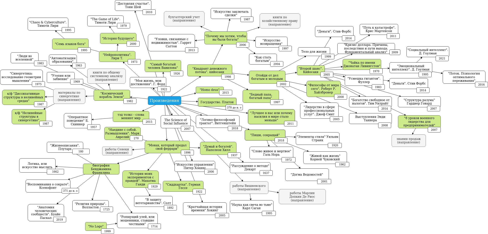

# book-mindmaps
Мои карты-заметки по книгам

<table>
	<tr>
		<th align="left">
			<a href="#books-mindmap">
				<h3>Books</h3>
        
Мой граф книг. Зеленым отмечены прочтенные, белым - книги, которые они упоминают.

				
			</a>
		</th>
		<th align="right">
			
			<a href="#bot-adapter">
				<h6>
				</h6>
				
			</a>
		</th>
	</tr>
	<tr>
		<td colspan="2" align="center">
			
		</td>
	</tr>
</table>
