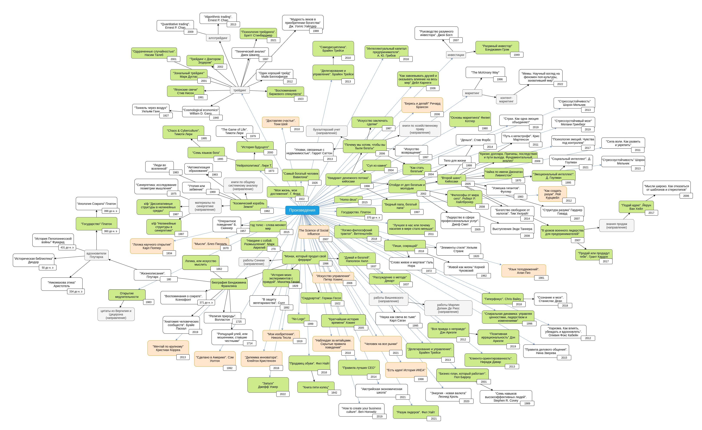

# book-mindmaps
Мои карты-заметки по книгам, произведениям

<table>
	<tr>
		<th align="left">
			<a href="#books-mindmap">
				<h3>Books</h3>
        
Мой граф книг. Зеленым отмечены прочтенные, белым - книги, которые они упоминают, но еще не прочитаны. Оранжевым - книги, которые ни на какие не ссылаются и еще не прочитаны.

				
			</a>
		</th>
	</tr>
	<tr>
		<td colspan="2" align="center">
			
		</td>
	</tr>
</table>

Исходник диаграммы находится в файле books.drawio, открыть можно через [Drawio-Desktop](https://github.com/jgraph/drawio-desktop/releases/tag/v16.5.1).

<table>
	<tr>
		<th align="left">
			<a href="#books-mindmap">
				<h3>Aspects of wealth</h3>
        
Аспекты богатства и способы перехода между ними

				
			</a>
		</th>
		<th align="right">
			
			<a href="#bot-adapter">
				<h6>
				</h6>
				
			</a>
		</th>
	</tr>
	<tr>
		<td colspan="2" align="center">
			
		</td>
	</tr>
</table>

---

## You might also be interested in:

---

### :globe_with_meridians: [Telegram канал](https://t.me/+VIvd8j6xvm9iMzhi)

